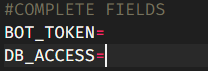

# create_discord_bot_v13

_A template of a discord bot, version 13._

## PARA EMPEZAR 🤖

_Este proyecto es una pequeña estructura de discord.js v13 con structuras basica de comandos normales y slashcommands._

---

## Instalación 🔧

_Comando que se debe ejecutar en la cmd para iniciar la instalación._

```
npx create_discord_bot_v13 nombre_de_tu_proyecto
```

_Una serie de ejemplos paso a paso que te dice lo que debes ejecutar para tener un entorno de desarrollo ejecutandose._

_Primero cargamos la ruta del proyecto_

```
cd "ruta_de_la_carpeta"
```

_Una vez seleccionada la carpeta ejecutaremos el comando_

```
npx create_discord_bot_v13 nombre_de_tu_proyecto
```

_Finalizaremos con el siguiente comando de cmd_

```
cd nombre_de_tu_proyecto && cd ${repoName} && npm run dev
```

---

## Configuración ⚙️

_Explica como ejecutar las pruebas automatizadas para este sistema_



## Author

    Markox36 or Dev-Markox36

<br>
<br>
<br>

[](https://www.youtube.com/channel/UCbdd2TLVH7DZ28Dap3a-E3A)
[](https://discord.gg/A8U2mn2dTB)


